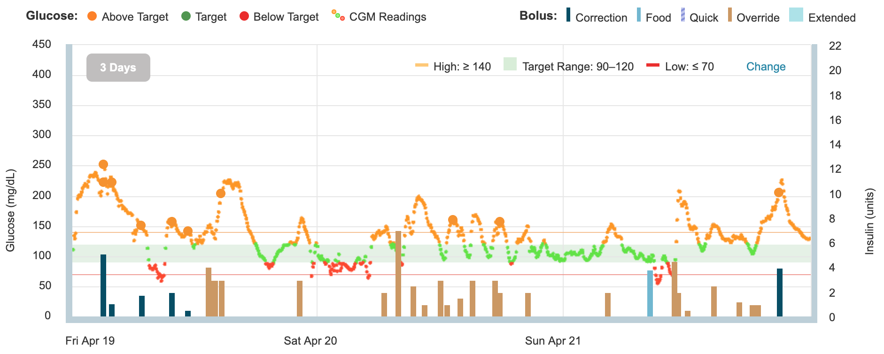

# insulin-sensitivity
Insulin sensitivity by blood glucose concentration in closed-loop type 1 diabetics

#### Motivation

Provide a pipeline to calculate instantaneous insulin sensitivity factor (ISF) across blood glucose ranges. 

#### Background

The [OpenAPS](https://openaps.org/) project provides tools for [\#WeAreNotWaiting](https://twitter.com/search?q=%23wearenotwaiting) people interested in providing a closed-loop solution to type-1 diabetics. Participants upload glucose and treatment data to [OpenHuman](https://github.com/danamlewis/OpenHumansDataTools)

This plot is representative of glucose and treatments over a 3 day period for an individual on standard continuous glucose monitor + insulin pump combo treatment.



We note that there are [many factors](https://diatribe.org/42factors) that affect blood sugar.

#### Back-of-napkin design

Independent variables: 

 1. Insulin 1/2-life (lambda): model with simple exponential decay, from which we can calculate *Insulin On Board* (IOB) for any point in time
 2. Blood glucose ranges: e.g. 32 to 384 by 32 (note that we may need to pull in earlier treatment data to calculate IOB)
 
Expected output:

 1. Point-in-time ISF estimates, displayed per range with population stats
 
Stretch goal:

 1. Segmentation analysis... (We lack labels for important known features like sex, weight, insulin-type, etc. But if we can demonstrate strong classification, it may be useful to request it from the community.) 

##### Inputs per individual: 

+ blood sugar data are stored in in entries\[...\].json in 5 minute increments

```json
{
    "type": "sgv", 
    "device": "share2", 
    "date": 1531871709000, 
    "sgv": 142, 
    "_id": "...", 
    "dateString": "2018-07-17T23:55:09.000Z", 
    "direction": "FortyFiveDown", 
    "": "..."       
}
```

+ insulin treatment data are stored in treatments\[...\].json at time of insulin dose delivery

```json
{
     "created_at": "2017-01-29T23:59:05Z", 
     "_id": "....", 
     "carbs": null, 
     "insulin": null, 
     "rate": 0, 
     "duration": 30, 
     "timestamp": "2017-01-29T23:59:05Z", 
     "temp": "absolute", 
     "enteredBy": "...", 
     "eventType": "Temp Basal", "absolute": 0.275
 }
```
